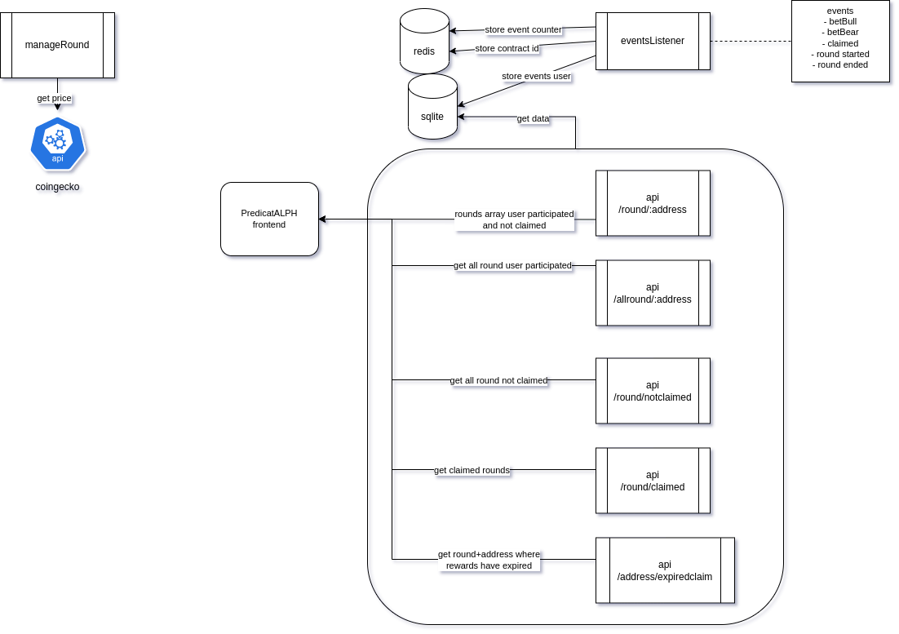

# [alph.bet](https://alph.bet)

[alph.bet](https://alph.bet) is a decentralized application developed on [Alephium](https://alephium.org).

The goal here is to find the sentiment of ALPH price, native token of Alephium. The player has two choices, Up or Down. Voting up means after the end of the interval the bidder thinks that the price is going to be higher than it was at the beginning of the round. If the price at the end of the round is higher than it was at the beginning then all the bidders who bid Up will won (with a ratio) everything that the bidder who bid Down.

If price is equal as it was at the beginning it means the house won and there's no rewards for the bidders.

## FAQ

### Claim rewards

When the bidder bid it have to "lock" 1 ALPH, it's a feature developed by Alephium to limit what is stored on-chain. This 1 ALPH can be retrieved when the rewards are claimed even if the bidder didn't choose the right side.

There's another feature on this dApp is that **anyone can claimed the rewards of any address after a certain period of time.** This incentive the need to get the rewards back.

### How do you get the price

For now it's an off-chain process, we are using coingecko to fetch the price but everything is written on-chain so anyone can check the price

## Documentation

### Contracts

#### Predictalph

**Main contract**

Field                | Type    | Description                                            | Mutable
-------------------- | ------- | ------------------------------------------------------ | -------
punterTemplateId     | ByteVec | template contract                                      | no
roundTemplateId      | ByteVec | template contract                                      | no
dynamicArrayForIntId | ByteVec | dynamic array contract id                              | no
epoch                | U256    | actual epoch running                                   | yes
operator             | Address | prediction game administrator                          | yes
feesBasisPts         | U256    | fees                                                   | yes
repeatEvery          | U256    | round interval time                                    | yes
claimedByAnyoneDelay | U256    | after how much time anyone can claim rewards to anyone | yes

#### Round

Field               | Type        | Description                                                               | Mutable
------------------- | ----------- | ------------------------------------------------------------------------- | -------
prediction          | Predictalph | contract id of predictalph                                                | no
epoch               | U256        | round epoch                                                               | no
priceStart          | U256        | price at the beginning of the round                                       | no
feesBasisPts        | U256        | fees for round                                                            | yes
bidEndTimestamp     | U256        | timestamp on when round is done                                           | yes
operator            | Address     | prediction game administrator                                             | yes
rewardsComputed     | Bool        | true if rewards calculated                                                | yes
totalAmountBoost    | U256        | set the amount added for the boost, players who won will get more rewards | yes
priceEnd            | U256        | price at the end of round                                                 | yes
totalAmount         | U256        | total amount for the round                                                | yes
amountUp            | U256        | total amount for up side                                                  | yes
amountDown          | U256        | total amount for down side                                                | yes
treasuryAmount      | U256        | total amount for fees pool                                                | yes
rewardAmount        | U256        | amount                                                                    | yes
rewardBaseCalAmount | U256        | rewards pool without fees, used to compute ratio rewards per user         | yes
counterAttendees    | U256        | number of bidder                                                          | yes

#### Punter (bidder)

Field             | Type        | Description                                          | Mutable
----------------- | ----------- | ---------------------------------------------------- | -------
prediction        | Predictalph | contract id of predictalph                           | no
punterAddress     | Address     | wallet address of the bidder                         | no
epoch             | U256        | epoch where the bidder is playing                    | no
upBid             | Bool        | side selected                                        | no
amountBid         | U256        | amount bid                                           | no
claimedByAnyoneAt | U256        | when the rewards can be claimed if the bidder didn't | no

### Components

